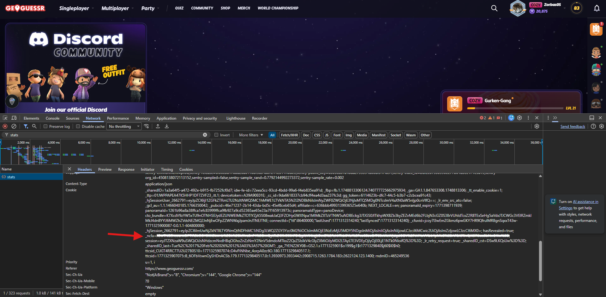

# GeoAnalyzr

GeoAnalyzr is a Tampermonkey userscript for analyzing your GeoGuessr games.  
It syncs your feed, fetches missing round details, and provides analysis plus Excel export.

## Requirements

For usage:
- A browser with Tampermonkey (Chrome/Edge/Firefox)
- A GeoGuessr account

For development:
- Node.js (latest LTS recommended)
- npm
- Git

## Installation (User)

1. Open this file in your browser:
   - `https://raw.githubusercontent.com/JonasLmbt/GeoAnalyzr/master/geoanalyzr.user.js`
2. Tampermonkey will show the install dialog.
3. Click install.

## Auto Updates

The script already includes:
- `@updateURL`
- `@downloadURL`

Tampermonkey can therefore detect and install updates automatically when you publish a new version to `main`.

## Usage

1. Open GeoGuessr and log in.
2. Open the GeoAnalyzr panel.
3. Run `Fetch Data` to sync new games and fetch missing details.
4. Optionally set an `_ncfa` token for more complete data fetching.
5. Open analysis or export to Excel.

## Development

Clone the repository:

```bash
git clone https://github.com/JonasLmbt/GeoAnalyzr.git
cd GeoAnalyzr
npm install
```

Build commands:

```bash
# Dev build (dist/userscript.user.js)
npm run build:dev

# Release build (geoanalyzr.user.js)
npm run build:release

# Build both
npm run build
```

Watch mode:

```bash
npm run watch
```

## Getting your `_ncfa` cookie

1. Open GeoGuessr in your browser and log in.
2. Open DevTools (`F12` / `Ctrl+Shift+I`, on Mac `Cmd+Option+I`).
3. Go to the `Network` tab.
4. Reload the page.
5. Filter by `stats`.
6. Open a `stats` request.
7. Locate the `_ncfa` cookie in the request headers.
8. Copy only the value after `=` and before `;`.



## Security and Privacy

- GeoAnalyzr does **not** use an external database and does not send analysis data to custom servers.
- Data is stored locally in your browser (IndexedDB).
- The `_ncfa` token is stored locally so you do not have to re-enter it every time.
- You can remove local data at any time using `Reset Database`.

## Acknowledgements

- [GeoInsights by Safwan Sipai](https://github.com/SafwanSipai/geo-insight)
- [GeoGuessr API guide](https://efisha.com/2022/04/18/geoguessr-api-endpoints/)
- [Fetching the _ncfa cookie](https://github.com/EvickaStudio/GeoGuessr-API?tab=readme-ov-file#authentication)
